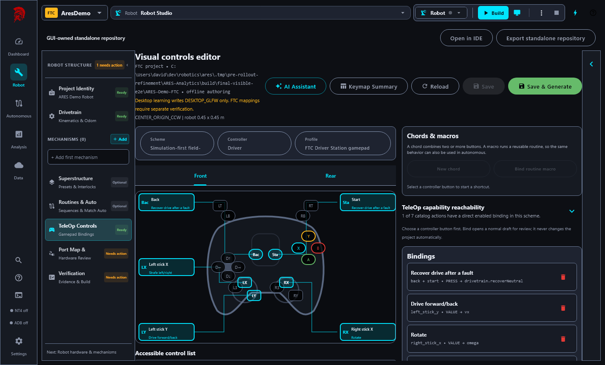
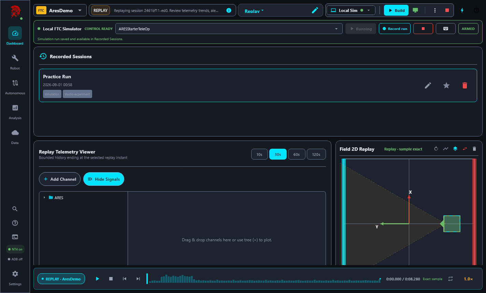
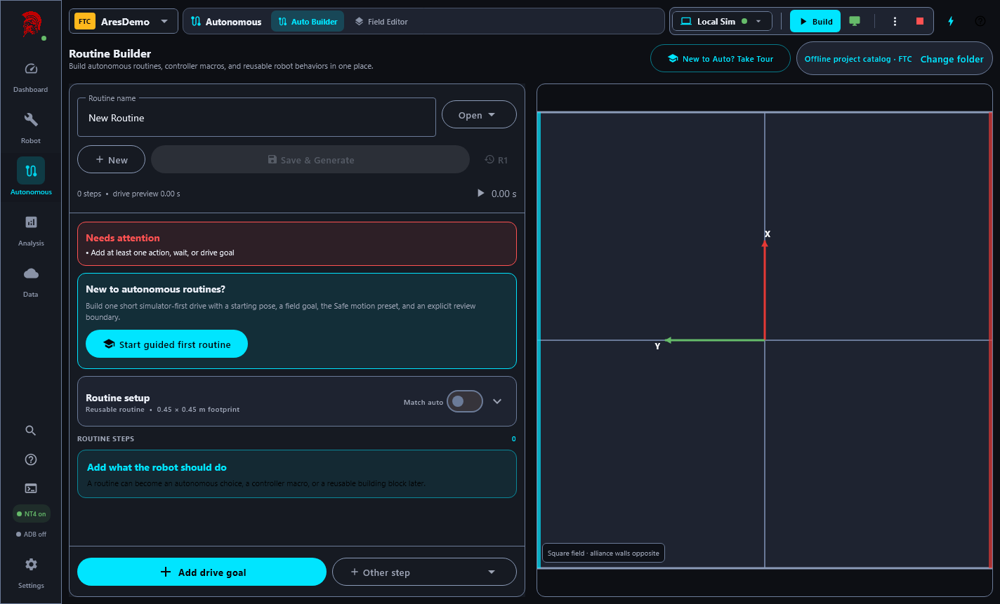
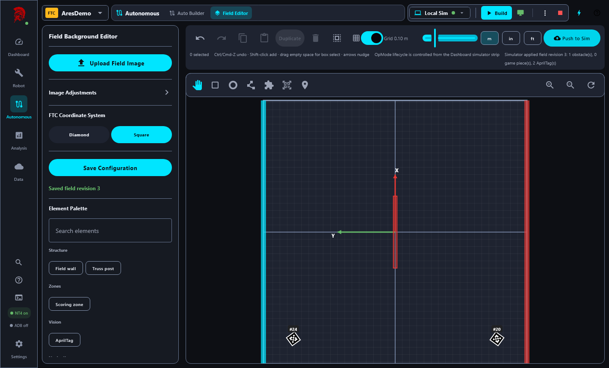

# Pre-rollout refinement acceptance

Date: 2026-09-01  
Branch: `codex/pre-rollout-refinement`  
Studio candidate: `4.0.1`  
ARES dependency candidate: `14.0.0-rc.pre-rollout.2`

This record describes the evidence collected for the pre-rollout architecture and usability
refinement. It is not a physical-robot commissioning record.

## Result

No known software P0 or P1 defect remains in the exercised release, generated-consumer,
simulator, telemetry, persistence, or packaged-desktop scope. FTC/FRC wiring, real motor direction,
radio behavior, current limits, brownout behavior, and physical mechanisms remain explicitly
deferred until a robot is available.

## Exact-candidate automated gates

ARESLib was built and published to an isolated validation repository as the unique candidate
`14.0.0-rc.pre-rollout.2`. The following gates passed against those exact bytes:

- ARESLib `test`, `apiCheck`, and `publishReleaseValidation` (171 tasks).
- ARES FTC unit tests, simulator tests, and Android `assembleDebug`.
- ARES FRC tests.
- FTC Starter generation, unit tests, simulator tests, and Android `assembleDebug`.
- FRC Starter generation and tests.
- Studio `studioReleaseVerification`, including all app/shared/gateway tests, Kover floors,
  production-file-size ratchets, exact dependency provenance, release-version alignment, and the
  dashboard performance baseline.
- Native Windows MSI packaging and maintenance metadata validation.

The resulting local MSI is `ARES Robotics Studio-4.0.1.msi`, with SHA-256:

```text
5BB9C4C33CA756749788664D9D876AED53F4F0723F9A04E625C7D27C8853B7A1
```

## Visible packaged-desktop acceptance

The actual packaged Windows executable—not a mocked view model—was launched with an isolated
application home. The journey:

1. Created a fresh editable FTC demo project.
2. Generated, verified, tested, and assembled the robot project successfully (66 Gradle tasks).
3. Launched the FTC simulator with the intended `ARESStarterTeleOp`.
4. Connected Studio to NT4 and observed the expected 20 ms robot loop.
5. Drove the simulated robot through the desktop input path.
6. Recorded and saved a practice run.
7. Opened deterministic replay and inspected the telemetry timeline and field playback.
8. Opened the controller editor and verified the novice-facing **Chords & macros** workflow.
9. Opened Autonomous Builder and Field Editor.
10. Added a field wall and pushed revision 3 to the live simulator.
11. Verified the simulator receipt reported one obstacle and two season AprilTags.
12. Closed Studio gracefully and confirmed the simulator process stopped.

### Controller chords and macros



### Recorded-run replay



### Autonomous Builder



### Field revision applied to the simulator



## Defect found by visible testing

The first clean journey exposed a release-relevant defect not caught by the prior headless suite:
the bundled demo inherited the starter field geometry but did not install its reviewed FTC season
AprilTag layout. Field Editor therefore refused to push a revision to the simulator.

The fix adds an explicit demo-only initial field preset resource to project creation. The installer
merges the reviewed season/tag metadata into the starter field while preserving its simulation
content. Ordinary standard-project creation is unchanged. Focused tests now cover both tag
installation and starter-content preservation, and the complete visible journey was repeated from
a new isolated application home after rebuilding the packaged app.

## Maintainability and reuse outcome

This milestone removed unused compatibility/prototype surfaces, narrowed accidental public APIs,
shared capability argument contracts and hashing, and decomposed large controller, routine,
Academy, subsystem-authoring, OAuth, and code-generation files. Reuse was accepted only where the
semantics and ownership match:

- Shared wire/schema contracts, deterministic validation, content hashing, and small UI patterns
  have one owner.
- FTC and FRC retain separate hardware adapters, lifecycle behavior, deployment paths, and
  simulators where the platforms differ.
- No universal hardware or simulator abstraction was introduced merely to reduce line count.
- No backwards-compatibility wrapper was added for unreleased APIs.

The branch contains 23 focused commits and changes 121 files, with roughly balanced additions and
removals. Remaining large-file debt is guarded by the production-size ratchet and can be reduced
incrementally when the owning workflow changes.

## Evidence boundaries

| Evidence level | Status |
| --- | --- |
| Configuration and architecture reviewed | Complete for this milestone |
| Compiled and automated suites | Complete against the exact isolated candidate |
| Simulation verified | Complete for the exercised FTC/FRC and packaged Studio journeys |
| Native Windows package verified | Complete locally |
| Ready for physical validation | Yes, subject to team safety procedures |
| Physically validated | No—intentionally deferred |

