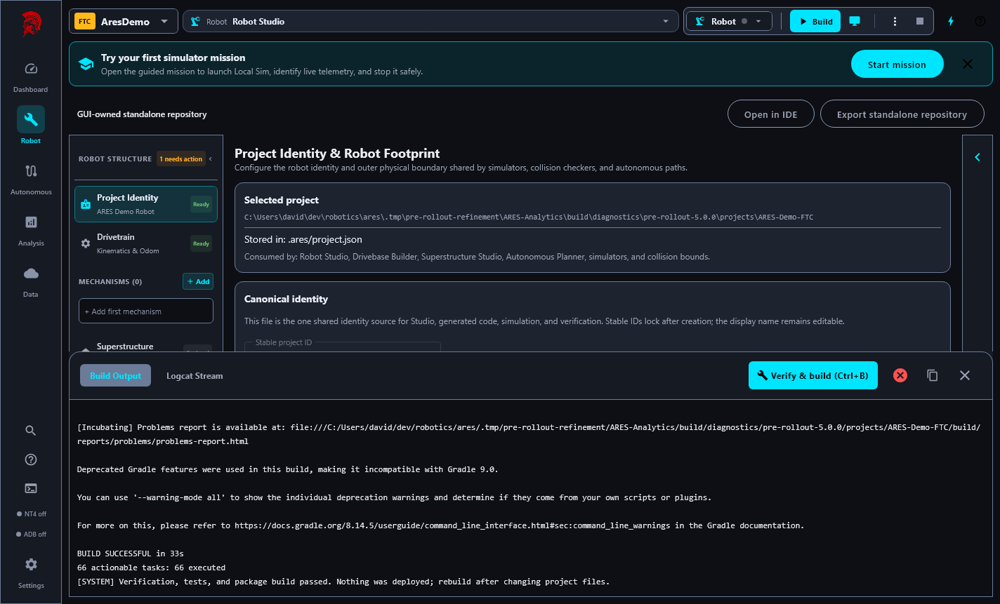
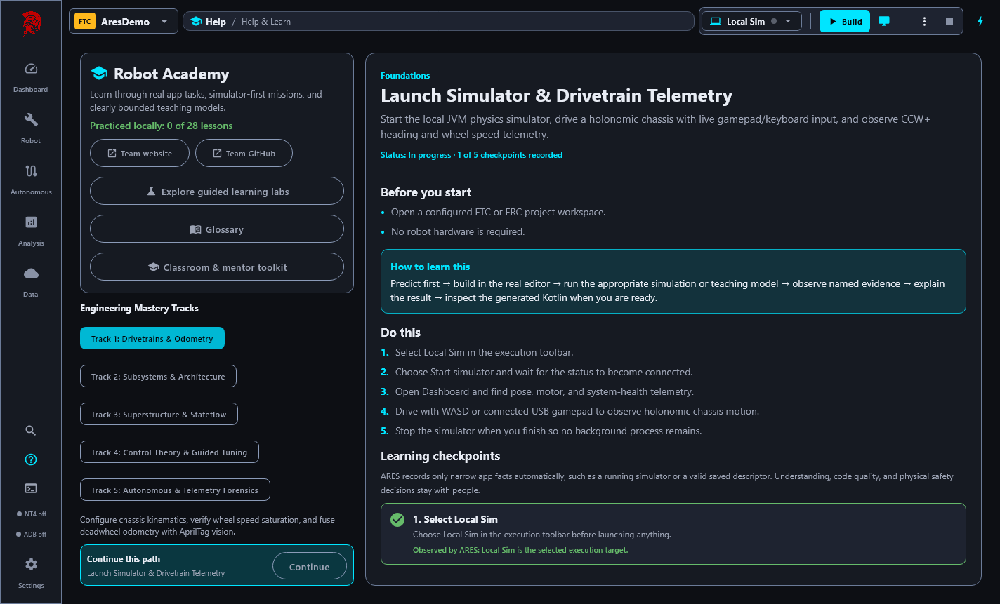
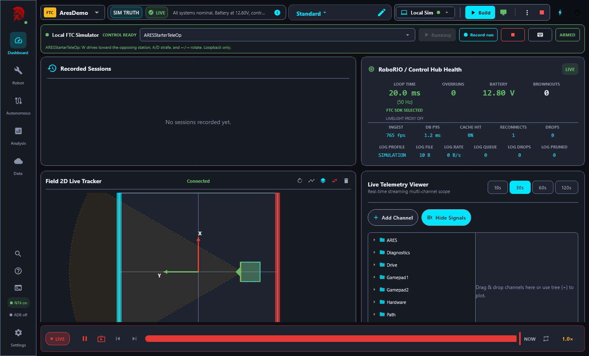
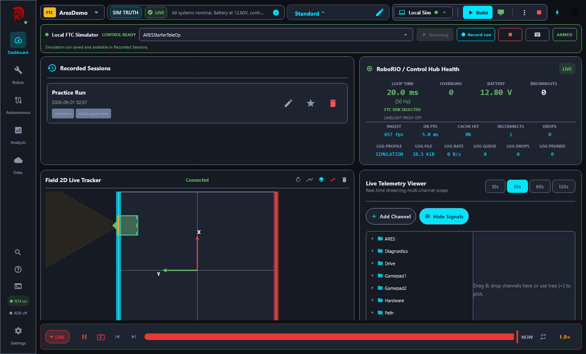
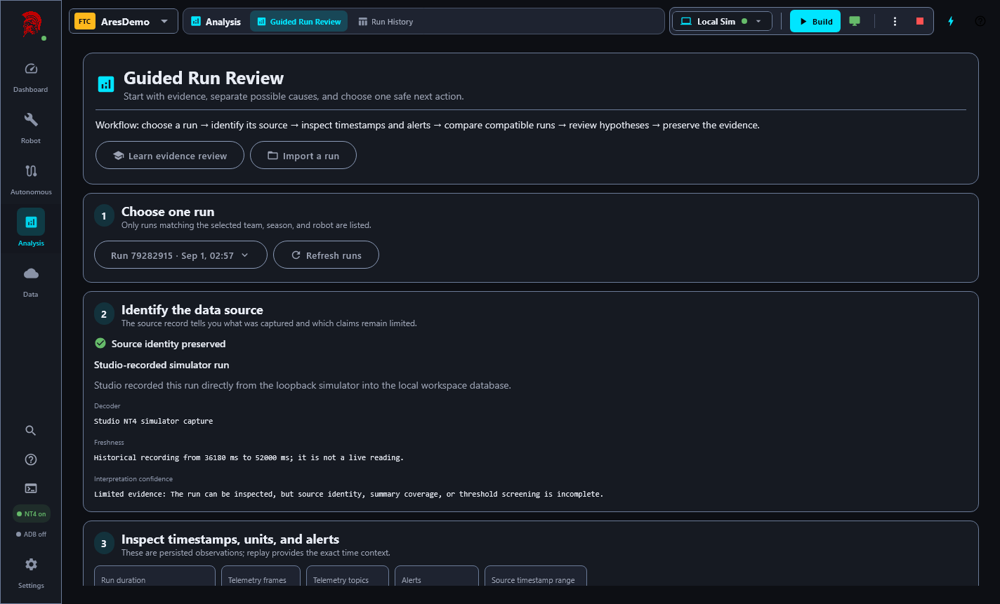
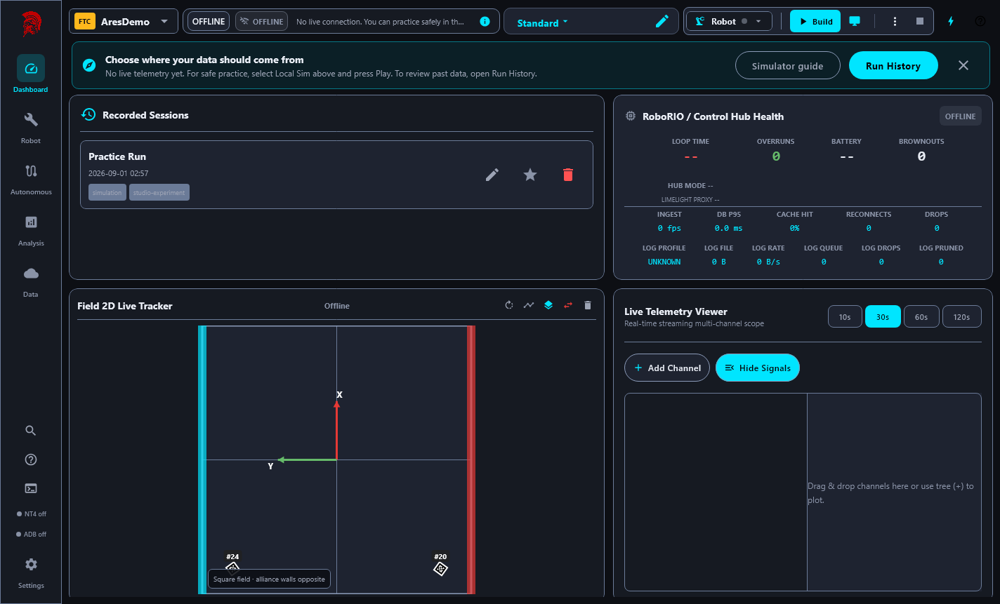

# Pre-rollout refinement acceptance

Date: 2026-09-01

Branch: `codex/pre-rollout-refinement`

Studio candidate: `5.0.0`

ARES dependency candidate: `15.0.0-rc.pre-rollout.2`

This record describes the evidence collected for the final pre-rollout architecture,
maintainability, usability, and release refinement. It is not a physical-robot commissioning
record.

## Result

No known software P0 or P1 defect remains in the exercised generated-consumer, simulator,
telemetry, persistence, desktop, or package scope. FTC/FRC wiring, real motor direction, radio
behavior, current limits, brownout behavior, and physical mechanisms remain explicitly deferred
until a robot is available.

## Sealed release identity

- ARES release: `15.0.0`
- Studio release: `5.0.0`
- Reviewed ARESLib tree: `7abb0cf4da1bda8dcfc8d0bed6a5e78ca8deea12`
- FTC Starter `15.0.0` SHA-256:
  `c0ecee911fa759b9ec408164736638c35d227cc115ce85ed3728f76f650849ec`
- FRC Starter `15.0.0` SHA-256:
  `f75c48797757a3bd5204e80b83bd49afa81b064a0f7a391af0643a5ead7daae0`

The final validation candidate used a unique pre-release identity instead of shadowing an
immutable release version. Studio, FTC, FRC, and both starters all resolved
`15.0.0-rc.pre-rollout.2` from the isolated validation repository.

## Exact-candidate automated gates

The following gates passed against those exact bytes:

- ARESLib `test`, `apiCheck`, and `publishReleaseValidation` (171 tasks).
- ARES FTC unit tests, simulator tests, and Android `assembleDebug`.
- ARES FRC tests.
- FTC Starter generation, verification, unit tests, simulator tests, and Android
  `assembleDebug`.
- FRC Starter generation, verification, and tests.
- Studio `studioReleaseVerification`, including every app/shared/gateway test suite, Kover floors,
  production-file-size ratchets, exact dependency provenance, release-version alignment, and the
  dashboard performance baseline.
- Release sealing, imported-history, documentation-link, and monorepo-policy checks.
- Deterministic starter export and bundled-archive verification.
- Native Windows MSI packaging and installer-maintenance metadata validation.

The resulting local MSI is `ARES Robotics Studio-5.0.0.msi`, with SHA-256:

```text
04EBD08DC5D9135D63D6B18264A64ECD5D80C48632C2F14F6ADB846DCEC3BFFC
```

The protected GitHub workflow is responsible for the signed Windows artifact and the native macOS
DMG. A Windows host cannot substitute for the required macOS-runner packaging result.

## Visible desktop acceptance

The actual Compose desktop application—not a mocked view model or headless fixture—was launched
against the exact local ARES candidate with an isolated application home. The journey:

1. Opened the first-run setup and selected the bundled FTC demo.
2. Created an editable local copy instead of editing the packaged source.
3. Generated, verified, tested, and assembled that robot successfully (66 Gradle tasks).
4. Opened the Academy simulator mission and selected Local Sim.
5. Launched the FTC simulator with the intended `ARESStarterTeleOp`.
6. Connected Studio over loopback NT4 and observed the expected 20 ms robot loop.
7. Drove the robot with sustained keyboard commands and observed field motion.
8. Recorded and saved a practice run into the isolated local database.
9. Opened deterministic replay and inspected the exact timeline and field playback.
10. Opened Guided Run Review and verified source identity, timestamp, and uncertainty language.
11. Resized the live application to maximized, 1440 x 900, and the supported 1100 x 700 minimum;
    all exercised controls remained legible and usable.
12. Closed Studio cleanly; its shutdown path stopped the simulator.
13. Launched the same exact candidate again, confirmed the copied robot and recorded run persisted,
    captured the restored dashboard, and closed cleanly a second time.

### Generated robot build



### Academy simulator mission



### Live simulator and telemetry



### Recorded run and deterministic replay




### Guided evidence review



### Restart persistence



## Maintainability and reuse outcome

This milestone removed unused compatibility and prototype surfaces, narrowed accidental public
APIs, consolidated shared wire contracts, generated starter metadata from canonical release
manifests, and decomposed large controller, routine, Academy, subsystem-authoring, OAuth,
code-generation, and drivetrain-builder files. Reuse was accepted only where semantics and
ownership match:

- Shared schema contracts, deterministic validation, content hashing, release metadata, and small
  UI patterns have one owner.
- FTC and FRC retain separate hardware adapters, lifecycle behavior, deployment paths, and
  simulators where the platforms differ.
- No universal hardware or simulator abstraction was introduced merely to reduce line count.
- No backwards-compatibility wrapper was added for an unreleased API.
- Studio release gates now enforce all suites, coverage floors, file-size ratchets, dependency
  provenance, and immutable version alignment.

Remaining lower-priority large-file debt is guarded by the production-size ratchet and can be
reduced incrementally when its owning workflow changes.

## Evidence boundaries

| Evidence level | Status |
| --- | --- |
| Configuration and architecture reviewed | Complete for this milestone |
| Compiled and automated suites | Complete against the exact isolated candidate |
| Simulation verified | Complete for the exercised FTC/FRC consumers and visible FTC Studio journey |
| Local persistence and replay | Complete in an isolated profile across restart |
| Native Windows package verified | Complete locally; protected signing remains a release-workflow concern |
| Native macOS package verified | Pending the protected GitHub macOS runner |
| Google Drive sync | Not revalidated in the isolated final-candidate profile |
| Ready for physical validation | Yes, subject to team safety procedures |
| Physically validated | No—intentionally deferred |
