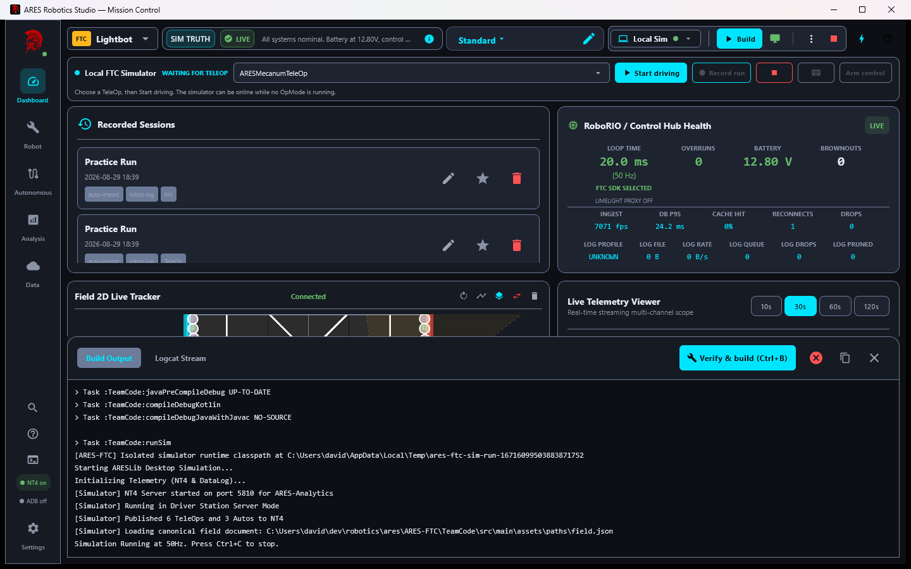
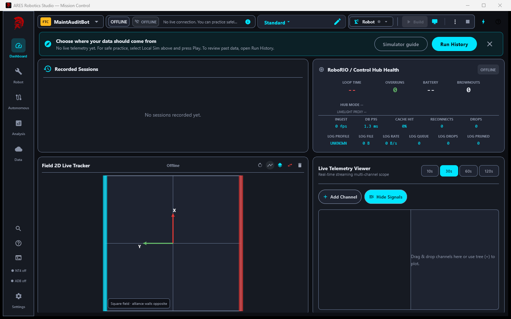
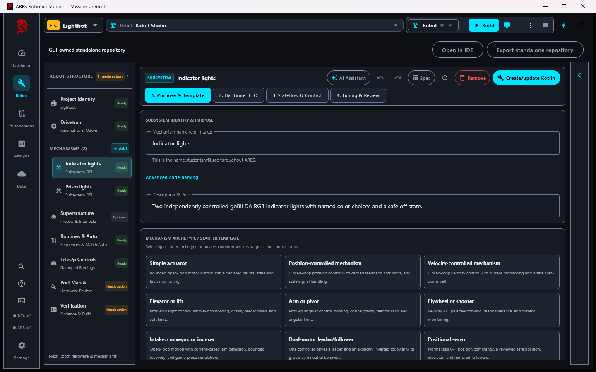
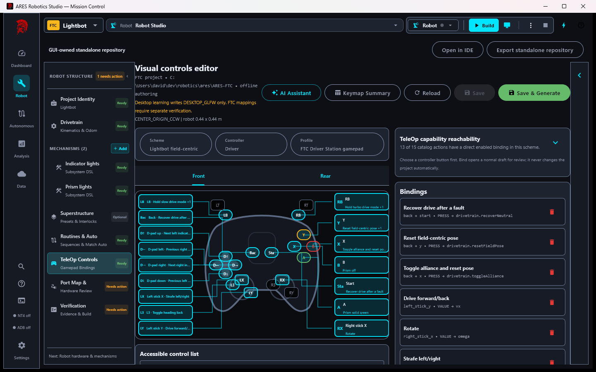
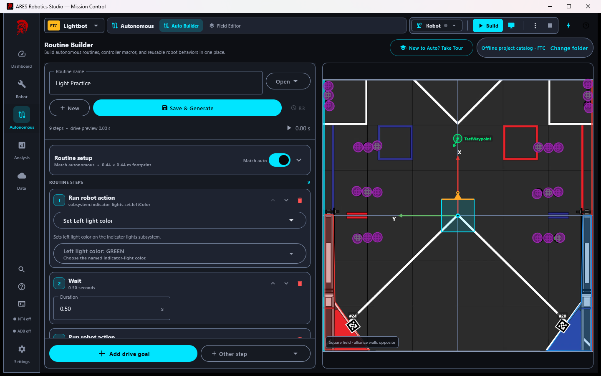
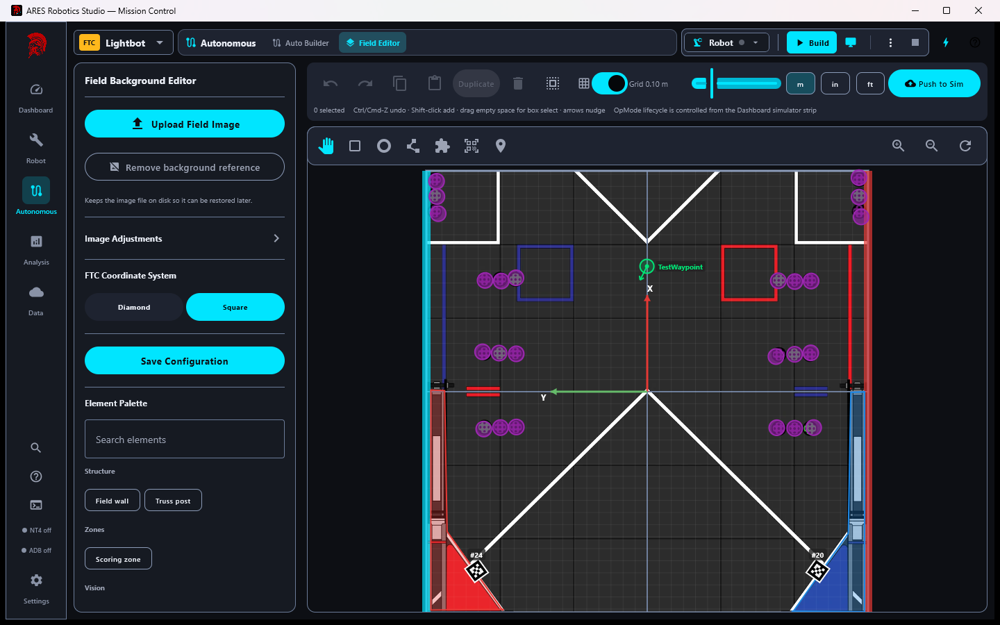

# ARES Robotics Studio 3.1.1 launch drafts

This document contains publish-ready copy for a community post and a longer project blog entry.
It is intentionally precise about what was tested: desktop packaging and simulation were verified;
physical FTC/FRC hardware was not available for this release cycle.

## Reddit / community post

### Title

ARES Robotics Studio 3.1.1: build an FTC or FRC robot visually, run its generated tests, and simulate it locally

### Post

We have released [ARES Robotics Studio 3.1.1](https://github.com/ARES-23247/ARES-Robotics/releases/tag/v3.1.1),
an open-source desktop environment for teaching robotics through a progression from visual
configuration to Kotlin extension code.

The current workflow can:

- create a standalone FTC or FRC project from a pinned starter bundled with the app;
- author a drivetrain, mechanisms, controller bindings, routines, field configuration, and safety
  contracts through Studio;
- generate mechanical Kotlin plumbing and descriptor-owned safety tests under Gradle generated
  directories;
- build and run an FTC desktop simulator or the FRC WPILib/HAL simulator;
- record, replay, compare, and explain telemetry while linking findings to source topics and times;
- export a GUI-owned, code-first, or hybrid repository that continues to build from its own Gradle
  wrapper after Studio is closed.

For this release we used the actual Windows app to open the GUI-authored Lightbot reference robot,
run its generation/unit/simulator/package verification, launch the FTC simulator, select a TeleOp,
and observe live NT4 telemetry. The protected release workflow separately builds the Windows MSI
and macOS DMG and creates fresh FTC and FRC starter projects. We have not claimed physical wiring,
motor direction, radio, CAN, or field validation; those remain explicit commissioning evidence.

The code and installers are in the single
[ARES Robotics monorepo](https://github.com/ARES-23247/ARES-Robotics). Feedback from students,
mentors, FTC teams, and FRC teams is welcome, especially around the transition from visual authoring
to code-first work.

## Longer blog post

### From a robot idea to reviewable evidence

ARES Robotics Studio is intended to teach the reasoning behind a competition robot without making a
new student begin with build systems, vendor APIs, or a blank Kotlin file. The visual tools are not a
replacement for programming. They establish typed robot structure, safety contracts, and simulation
evidence, then expose explicit Kotlin extension points when a team's behavior no longer fits a
catalog template.

Studio 3.1.1 is distributed for Windows and macOS. It contains pinned FTC and FRC starter archives,
so creating a project does not clone a mutable branch. The resulting repository has its own Gradle
wrapper, canonical `.ares` documents, generated-source and generated-test directories, USER-OWNED
extension packages, and normal build/simulate/deploy tasks. A student can close Studio and continue
from Android Studio for FTC, WPILib VS Code for FRC, IntelliJ, or a terminal.

### Visual authoring with explicit ownership

Robot Builder owns deterministic configuration, not arbitrary source-code reconstruction. A
GUI-owned project treats its `.ares` documents as canonical. A code-first project treats its Kotlin
implementation as authoritative and publishes registration metadata for actions, telemetry,
tunables, safety evidence, and simulation capabilities. A hybrid project can keep a Studio-authored
drivetrain and routines while mechanisms live in USER-OWNED Kotlin.

Controller bindings use a diagram rather than a flat key/value list, while the accessible list below
the diagram remains available for review and assistive technology.

Autonomous routines select declared robot actions; missing actions are validation failures rather
than strings that fail later on the robot. The field editor and routine builder share coordinate,
AprilTag, obstacle, and game-piece configuration with simulation.

### Verification is part of the authored robot

Each drivetrain and subsystem descriptor records expected neutral behavior, feedback freshness,
limits, homing, fault latching, recovery, simulator support, and generated-test requirements. The
Builder converts those contracts into mechanical tests, then Studio combines their results with
platform integration, simulator, package, and physical-review evidence in one report.

The evidence labels are deliberately distinct:

- configuration reviewed;
- compiled successfully;
- simulation verified;
- ready for physical validation;
- physically validated.

A simulator pass cannot mark wiring or physical behavior as validated. That separation is useful in
a classroom because students can explain what their evidence proves before a mentor or inspection
checklist becomes a substitute for understanding.

### Telemetry remains inspectable

Robots do not upload directly to cloud services. They expose logs locally; Studio pulls them over the
robot network, stores and analyzes them on the laptop, and can optionally synchronize reviewed data.
Recorded runs can be replayed and compared without mixing time bases or units. Guided findings link
back to the source interval and distinguish correlation from demonstrated cause.

### What we verified, and what remains

The 3.1.1 release gates run all Studio unit suites, coverage ratchets, dashboard performance checks,
fresh generated FTC/FRC project builds, simulator tests, deterministic starter archives, Windows
installer maintenance checks, and macOS packaging. A visible-app Windows journey also built the
Lightbot project and launched its FTC desktop simulator.

No physical robot was available during this cycle. Control Hub/RoboRIO deployment, real motor and
encoder polarity, radio behavior, CAN health, current limits, and mechanism commissioning still need
on-robot evidence. Studio keeps those items separate instead of converting simulation into a
hardware claim.

Source, release artifacts, and issue tracking:
[github.com/ARES-23247/ARES-Robotics](https://github.com/ARES-23247/ARES-Robotics).
