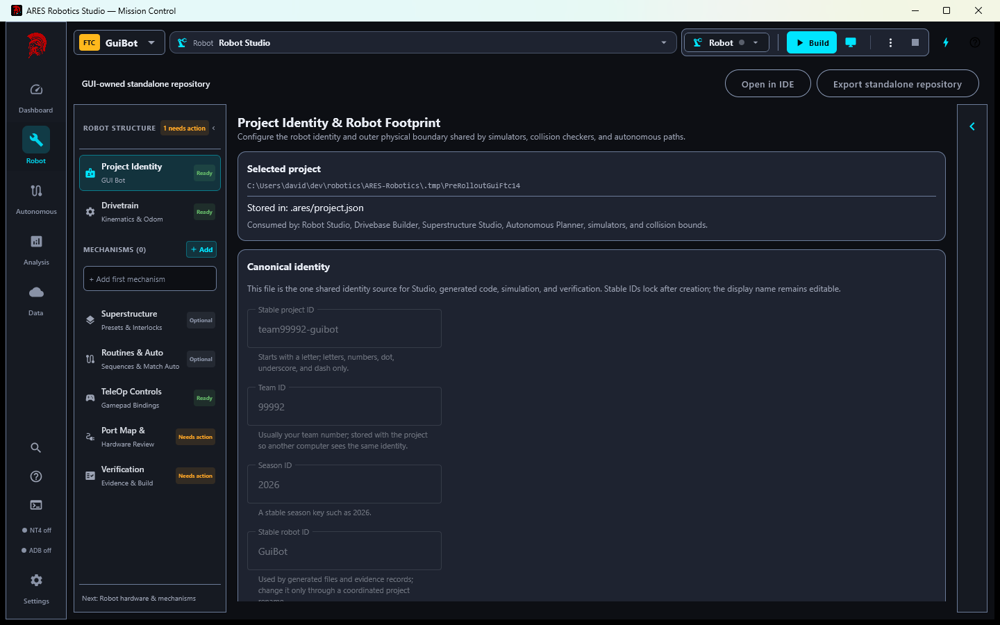
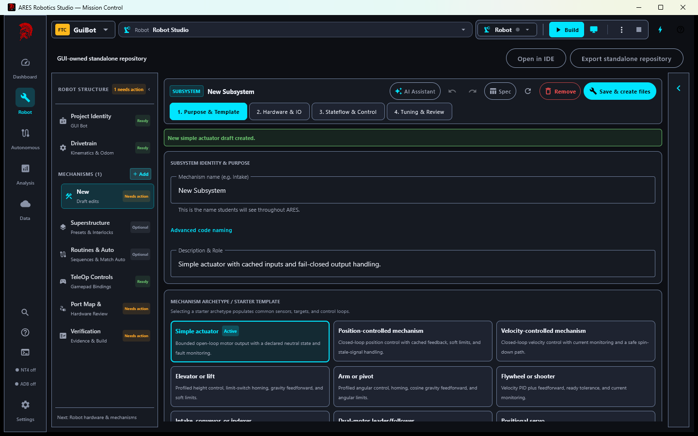
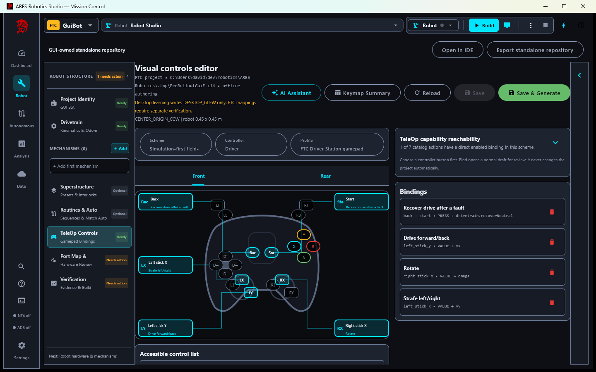
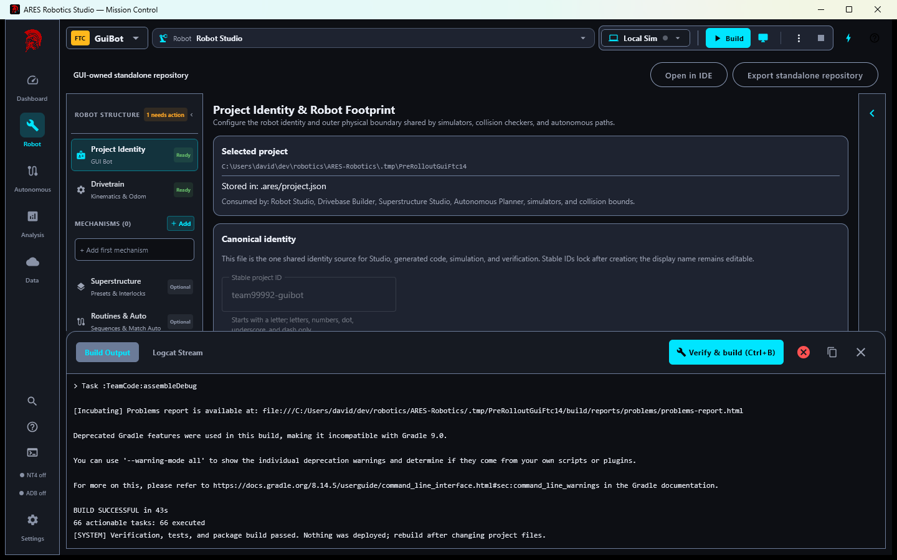
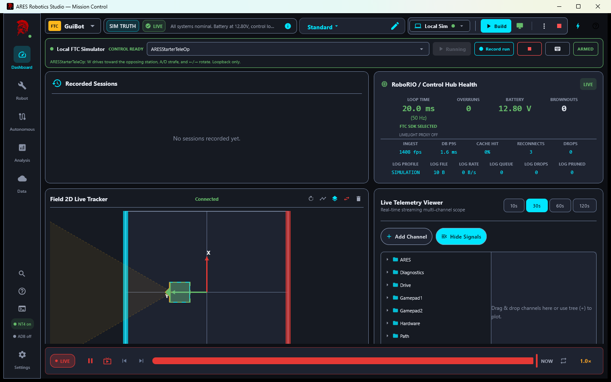
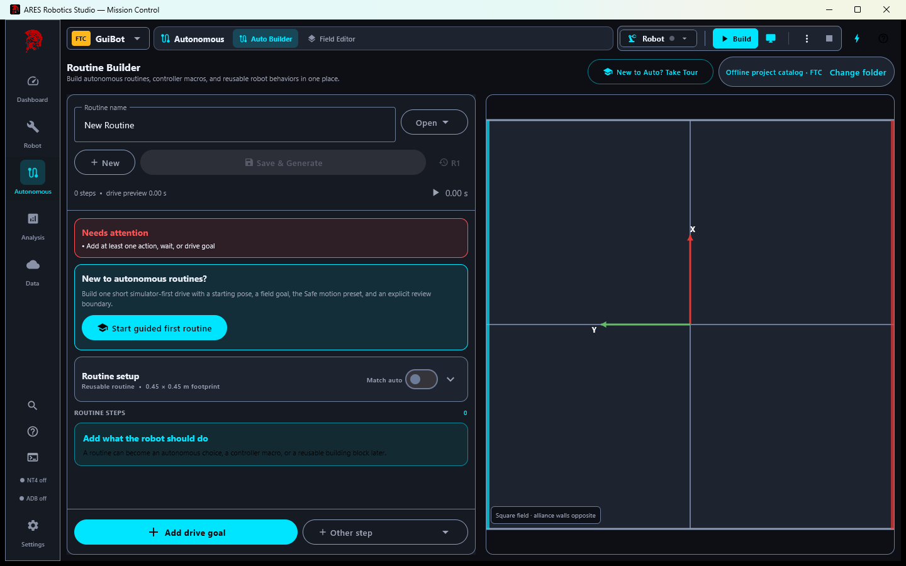
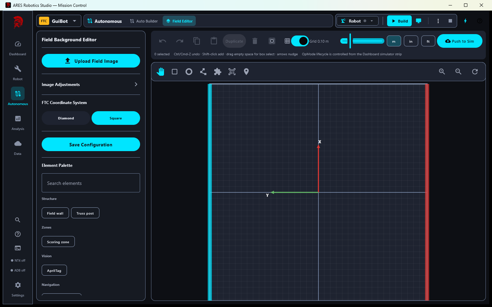
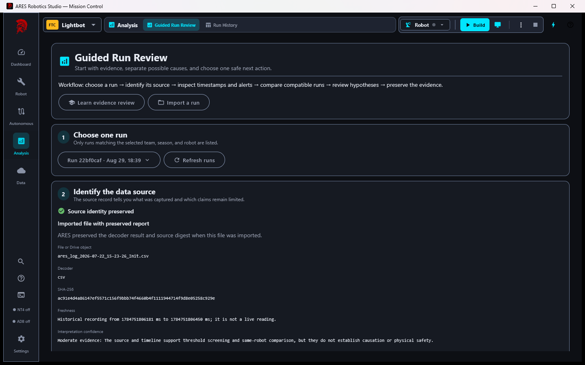

# ARES Robotics Studio 4.0.0 preview and launch draft

This is publish-ready community and blog copy for the clean-slate ARES 14 / Studio 4 milestone. It
must remain a preview until the protected release workflow publishes signed installers. Every claim
below is limited to source, build, generated-project, and local simulation evidence gathered on
August 31, 2026. No physical FTC or FRC robot was available for this validation cycle.

## Short community / Reddit post

### Title

We built a visual FTC/FRC robot workflow that exports real standalone projects—not a toy block-code island

### Post

We have been rebuilding [ARES Robotics Studio](https://github.com/ARES-23247/ARES-Robotics) around a
simple teaching idea: students should be able to create a robot visually, understand the safety and
control decisions they are making, simulate it, inspect evidence, and then move into ordinary Kotlin
when they are ready.

The upcoming Studio 4.0.0 / ARES 14 milestone can create GUI-owned, code-first, or hybrid FTC and FRC
projects. An exported project has its own Gradle wrapper, pinned immutable ARES dependencies,
canonical `.ares` documents, generated sources and safety tests in Gradle-generated directories, and
clearly USER-OWNED extension packages. FTC projects open normally in Android Studio; FRC projects use
the normal WPILib/GradleRIO workflow. Studio is not required after export.

Students can choose drivetrain and mechanism templates, review hardware and safety contracts, map a
controller visually, build autonomous routines, edit the field, and run one novice-friendly
verification report.

For this milestone we used the actual Windows desktop app to create a fresh GUI-owned FTC robot,
generate its project, run its tests, build its APK, launch its simulator, select the generated
TeleOp, and drive it from the keyboard while Studio received live NT4 telemetry. We also ran the
complete ARESLib, FTC, FRC, both starter, Studio, gateway, coverage, and monorepo policy gates against
one isolated ARES 14 candidate.

This is simulation and software evidence, not a claim that wiring, motor direction, radio behavior,
CAN health, or mechanism limits have been validated on hardware. We would love feedback from
students and teams on whether the progression from visual authoring to normal code feels clear.

## Longer blog post

### A visual tool should teach the system, not hide it

Block programming is approachable, but it can become an island: a student learns the tool's blocks
rather than the architecture, units, timing, safety boundaries, and evidence used by a competition
robot. Starting with an empty Kotlin project has the opposite problem. It exposes everything before
a beginner has a mental model for any of it.

ARES Robotics Studio aims for a middle path. Students author typed robot intent through focused
forms, diagrams, and guided workflows. ARES deterministically compiles those documents into
mechanical Kotlin plumbing and generated safety tests. The generated files are replaceable; the
student's extension packages are not. As students grow, they can leave Studio open as a simulator and
telemetry tool, or close it and work entirely in Android Studio, WPILib VS Code, IntelliJ, or a
terminal.

### One robot identity, three ownership models

Studio 4 supports three explicit project models:

- **GUI-owned:** canonical `.ares` documents own the robot configuration and generated plumbing.
- **Code-first:** Kotlin owns behavior and publishes registration metadata for actions, telemetry,
  tunables, safety evidence, and simulation capability.
- **Hybrid:** Studio can own the drivetrain, controls, and routines while unusual mechanisms remain
  hand-authored Kotlin.

ARES does not attempt to reverse-engineer arbitrary Kotlin back into forms. Ownership stays explicit,
which makes regeneration predictable and keeps source review honest.

### Mechanisms and controls are designed, not merely named

Subsystem templates cover simple actuators, position and velocity control, elevators, pivots,
flywheels, intake/indexer systems, dual-motor followers, and other common mechanisms. The same
descriptor records safe neutral output, feedback freshness, limits, homing, fault latching,
recovery, tuning, and simulator expectations.

The visual controller editor shows the physical controller and the resulting bindings together. An
accessible list remains below the diagram. Bindings target declared project actions; an undeclared
string cannot silently become a runtime surprise.

### Autonomous and field authoring share one coordinate contract

The autonomous builder and field editor share the robot footprint, field coordinate convention,
obstacles, game pieces, AprilTags, and simulation boundary. Students can start with a guided drive
goal, then add declared robot actions, waits, conditions, and reusable routines.

This milestone also removes independent FTC/FRC copies of shared field, drive, and autonomous wire
contracts. FTC and FRC keep their own hardware adapters and simulator implementations because their
controllers, vendor libraries, and physics assumptions are genuinely different.

### Verification is part of the robot definition

The Builder generates tests for the behavior it owns: safe startup and stop, subsystem state,
feedback failures, failed writes, limits, homing, recovery, generated actions, and simulator parity.
ARES retains separate hand-written tests for platform lifecycle, Redux, generation, telemetry,
autonomous orchestration, coordinate frames, packaging, and migration infrastructure.

Studio presents them as one report with evidence levels such as configuration reviewed, compiled,
simulation verified, ready for physical validation, and physically validated. The last two are never
inferred from a simulator.

### Logs become an engineering conversation

Studio stores runs locally, supports deterministic replay, compares compatible runs without mixing
timestamps or units, and links guided findings back to the exact interval and underlying topics. The
goal is not an AI verdict. It is a student-friendly evidence loop: state what changed, inspect the
signal, distinguish correlation from demonstrated cause, propose one bounded experiment, and keep a
reviewable report.

Cloud sync is optional and desktop-owned. Robot production code contains no cloud client. A simulator
run does not send team notifications or upload data merely because it exists.

### What the clean-slate milestone changed underneath

Before rollout, we used the freedom to make breaking changes instead of preserving accidental APIs:

- moved all active development into one source monorepo while retaining toolchain-specific Gradle roots;
- reset canonical project identity to one schema and deleted legacy compatibility paths;
- curated ARESLib's public surface with explicit API mode and API baselines;
- removed dead and duplicate runtime implementations;
- consolidated shared telemetry, topology, field, drive, and autonomous contracts;
- hardened stale tuning, hardware health, offsets, and actuator failures to fail closed;
- reduced hot-loop allocations and separated lower-rate immutable diagnostic publication;
- made Studio workspace changes tear down simulator, deployment, NT4, and workspace-owned jobs before
  the next project can become active;
- added coverage, file-size, dependency provenance, starter, namespace, and monorepo policy gates.

### What we actually tested

The August 31 acceptance cycle passed:

- every ARESLib module test and API baseline;
- FTC generated-project tests, desktop simulator tests, and debug APK assembly;
- FRC generated-project, safety, autonomous, SysId, field, and simulation tests;
- fresh FTC and FRC standalone starter tests and package builds;
- all Studio app, shared-model, and gateway tests plus Kover coverage ratchets and dashboard performance checks;
- monorepo ownership, namespace, documentation-link, dependency, and copied-runtime policy checks;
- a visible Windows app journey that created a fresh GUI-owned FTC robot, built it, launched its
  simulator, selected its TeleOp, drove it, received live telemetry, switched workspaces, and shut
  down cleanly.

Physical commissioning remains deliberately outstanding. The next hardware session must verify
wiring, motor/encoder polarity, controller configuration, current limits, safe neutral behavior,
radio/CAN health, and mechanism limits on an actual robot.

Source and issue tracking are in the
[ARES Robotics monorepo](https://github.com/ARES-23247/ARES-Robotics). The protected release workflow
will be the source of signed installers when 4.0.0 is published.
